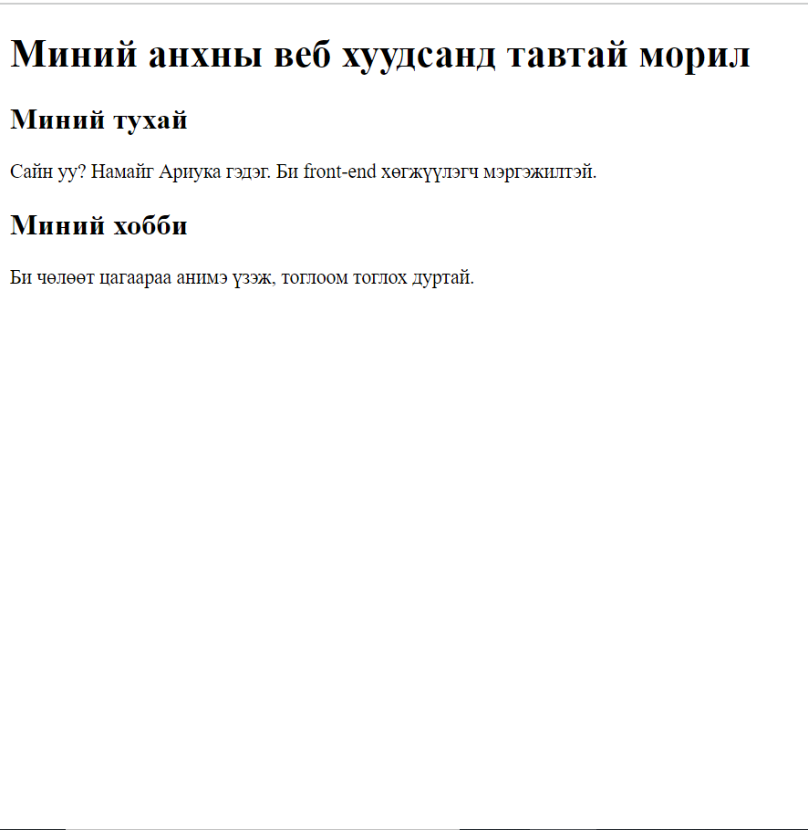

# Хичээл 1: HTML танилцуулга
<!-- TODO: CHange video -->
### [Бичлэг үзэх](https://youtu.be/-AAQxRKrkRc?si=lrsUSN8qvuwzZoCP&t=495)

### [Slide үзэх](https://docs.google.com/presentation/d/1Z-QuPHIo68OwinDLUl5FvrlB6VS-hh7e1aUUsbyR3e8/edit?usp=sharing)
 

# Hands-on

### 1. HTML Basics

### 2. Formatting Code

### 3. Inspect Page (devtools) - DOM

### 4. Summary

## Лекц бататгах тест: https://kahoot.it/ пассийг багш хэлнэ.

# Дасгал ажил:

### intro.html файл дээр байгаа жишээг ашиглан өөрсдийн танилцуулга веб сайтаа хийнэ. Дараа нь танилцуулга хуудсан ашиглан ангиараа танилцаарай 😎

- Nickname
- Нас
- Хобби
- Дуртай кино, анимэ
- Тоглох дуртай тоглоом
- Дуртай хоол
- Миний тухай сонирхолтой фактууд гэх мэтээр бичмээр байгаа бүх зүйлсээ бичээрэй.
  - Tip:
  - example хавтсанд байгаа жишээг ашиглаарай. 😉

### Жишээ нь:

- 
